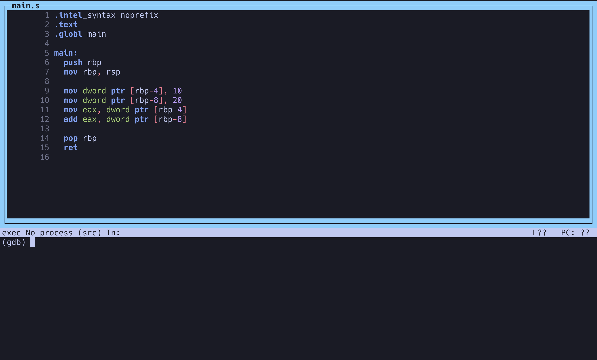

# 2. プログラムカウンタ

`main.s`をビルドします。

```sh
gcc main.s
```

`a.out`の中身を見てみます。

```sh
objdump -M intel -d a.out
```

出力例:

```txt
...

0000000000001129 <main>:
    1129:       55                      push   rbp
    112a:       48 89 e5                mov    rbp,rsp
    112d:       c7 45 fc 0a 00 00 00    mov    DWORD PTR [rbp-0x4],0xa
    1134:       c7 45 f8 14 00 00 00    mov    DWORD PTR [rbp-0x8],0x14
    113b:       8b 45 fc                mov    eax,DWORD PTR [rbp-0x4]
    113e:       03 45 f8                add    eax,DWORD PTR [rbp-0x8]
    1141:       5d                      pop    rbp
    1142:       c3                      ret

...
```

---

`a.out`をステップ実行し、レジスタの動きを観察します。

デバッグビルドします。

```sh
gcc -g main.s
```

`gdb`で実行します。

```sh
gdb -q ./a.out
```

`Ctrl-x` + `Ctrl-a`でTUIモードにします。



`main`にブレークポイントを置いて実行します。

```sh
break main.s:6
run

# ソースではなく実行されているアセンブリを見たい場合
set disassembly-flavor intel # intel記法で見たいなら実行
layout asm

# 現在のレジスタを確認
info reg

# 個別に見たい値を設定
disp $rbp
disp $rsp
disp $rip
disp *(int*)($rbp-4)
disp *(int*)($rbp-8)
```

`si`でステップ実行します。

```sh
# 実行するごとにアセンブリが一命令実行される
si
```

`si`で実行しながら`rip`やスタック変数がどのように変化するか観察してみましょう。

